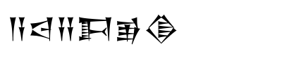

# Sumerian AES Vault

🏺 Sumerian AES Vault: Where ancient meets modern cryptography. A unique password protection system that combines AES-256 encryption with Sumerian cuneiform visualization.

## Download

> 🚀 [Download SumerianAESDualEncryption_v1](https://github.com/southglory/sumerian-aes-vault/releases/tag/SumerianAESDualEncryption_v1)

Requirements:

- Windows 10/11
- "Segoe UI Historic" font for Sumerian characters

## Choose Your Language

- [English Documentation](docs/README_EN.md)
- [한국어 문서](docs/README_KO.md)

## Quick Links

- [Features](docs/README_EN.md#key-features)
- [Build Instructions](docs/README_EN.md#build-instructions)
- [Security Features](docs/README_EN.md#security-features)

## License

MIT License

## Contact

Want to collaborate on interesting projects? Contact us at devramyun@gmail.com
