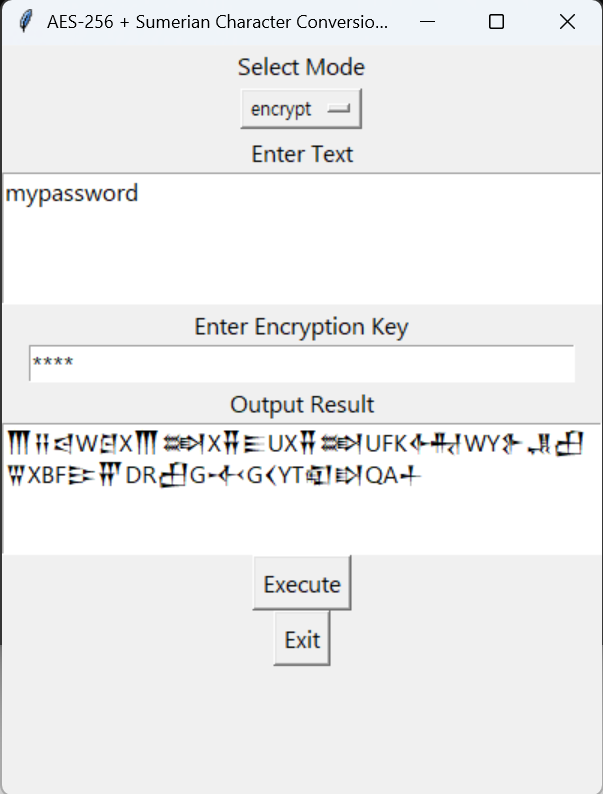
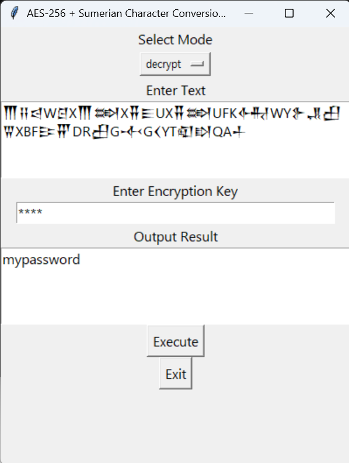

# Sumerian-AES Vault

🏺 Sumerian-AES Vault: Where ancient meets modern cryptography. A unique password protection system that combines AES-256 encryption with Sumerian cuneiform visualization. Features GUI interface, bidirectional encryption/decryption, and beautiful ancient script output. Built with Python 🐍 | AES-256 🔐 | Cuneiform UI 𒀀

## Introduction: Sumerian + AES-256 Encryption Program

A unique dual encryption system that combines ancient Sumerian characters with modern AES-256 encryption. This program allows you to securely protect sensitive passwords while storing them in a visually distinctive form.

## Key Features

- **Dual Encryption System**
  - AES-256 CBC mode encryption
  - Base64 encoded ciphertext conversion to Sumerian characters
- **Intuitive GUI Interface**
- **Bidirectional Conversion Support** (Encryption/Decryption)

## Screenshots

### Encryption



### Decryption



## Tech Stack

- Python 3.8+
- tkinter (GUI)
- pycryptodome (AES encryption)
- pyinstaller (executable build)

## Supported Input Characters

- English alphabet (a-z, case-insensitive)
- Numbers (0-9)
- Special characters: `+`, `/`, `=`, ` `, `.`, `,`, `!`, `?`, `@`, `#`, `$`, `%`, `^`, `&`, `*`, `(`, `)`, `-`, `_`, `[`, `]`, `{`, `}`, `|`, `\`, `:`, `;`, `"`, `'`, `<`, `>`, `` ` ``, `~`

## Build Instructions

1. Install required packages:

```bash
pip install -r requirements.txt
```

2. Generate executable with PyInstaller:

```bash
pyinstaller --onefile --name "SumerianAESDualEncryption" --paths="./program1" program1/script_EN.py
```

## Build Notes

1. **Python Version**: Python 3.13 or higher recommended
2. **Font Support**: "Segoe UI Historic" font must be installed on Windows for proper Sumerian character display
3. **Environment Setup**:
   - Windows environment recommended for building
   - Expected executable size: ~20-30MB

## Usage Notes

1. **Encryption Key**
   - Supports up to 32 bytes (characters)
   - Short keys are automatically padded to 32 bytes
2. **Input Text**
   - Unsupported characters may be output as-is
   - Recommended maximum length: 1000 characters

## Security Features

- AES-256 CBC mode implementation
- Random IV (Initialization Vector) generation
- PKCS7 padding
- Base64 encoding
- Additional obfuscation through Sumerian character conversion

## License

MIT License

## Contact

Want to collaborate on interesting projects? Contact us at devramyun@gmail.com

[한국어 버전](README_KO.md)
