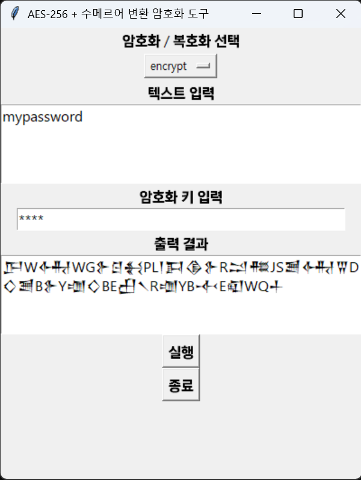
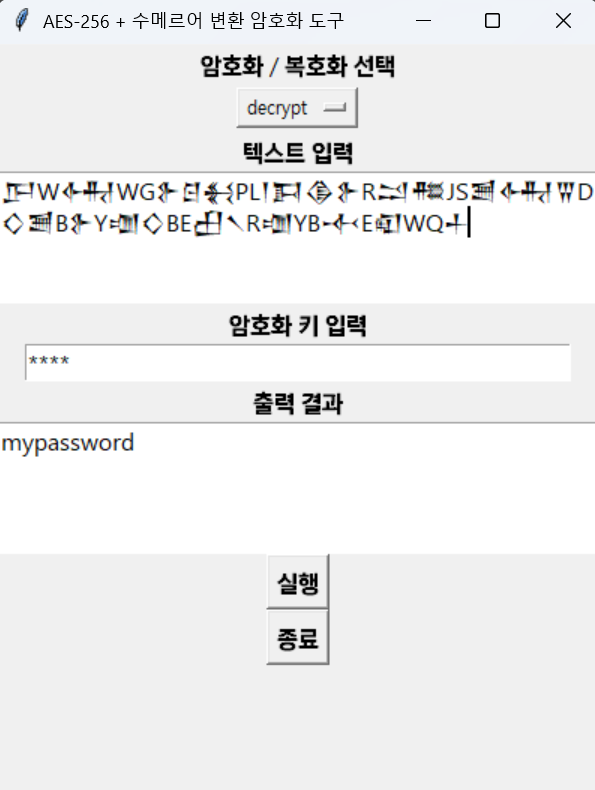

# sumerian-aes-vault

🏺 Sumerian-AES Vault: 고대와 현대 암호화의 만남. AES-256 암호화와 수메르 쐐기문자 시각화를 결합한 독특한 비밀번호 보호 시스템입니다. GUI 인터페이스, 양방향 암호화/복호화, 아름다운 고대 문자 출력을 제공합니다. Python 🐍 | AES-256 🔐 | 쐐기문자 UI 𒀀

## 소개: 수메르어 + AES-256 암호화 프로그램

고대 수메르 문자와 현대 AES-256 암호화를 결합한 독특한 이중 암호화 시스템입니다. 이 프로그램은 민감한 비밀번호를 안전하게 보호하면서도 시각적으로 특별한 형태로 저장할 수 있게 해줍니다.

## 주요 기능

- **이중 암호화 시스템**
  - AES-256 CBC 모드 암호화
  - Base64 인코딩된 암호문을 수메르 문자로 변환
- **직관적인 GUI 인터페이스**
- **양방향 변환 지원** (암호화/복호화)

## 스크린샷

### 암호화



### 복호화



## 기술 스택

- Python 3.8+
- tkinter (GUI)
- pycryptodome (AES 암호화)
- pyinstaller (실행 파일 빌드)

## 지원하는 입력 문자

- 영문 알파벳 (a-z, 대소문자 구분 없음)
- 숫자 (0-9)
- 특수문자: `+`, `/`, `=`, ` `, `.`, `,`, `!`, `?`, `@`, `#`, `$`, `%`, `^`, `&`, `*`, `(`, `)`, `-`, `_`, `[`, `]`, `{`, `}`, `|`, `\`, `:`, `;`, `"`, `'`, `<`, `>`, `` ` ``, `~`

## 빌드 방법

1. 필요한 패키지 설치:

```bash
pip install -r requirements.txt
```

2. PyInstaller로 실행 파일 생성:

```bash
pyinstaller --onefile --name "수메르AES이중암호화" --paths="./program1" program1/script_KO.py
```

## 빌드 시 주의사항

1. **Python 버전**: Python 3.13 이상 권장
2. **폰트 지원**: Windows의 경우 "Segoe UI Historic" 폰트가 설치되어 있어야 수메르 문자가 정상적으로 표시됨
3. **환경 설정**:
   - Windows 환경에서 빌드 권장
   - 실행 파일 크기: 약 20-30MB 예상

## 사용 시 주의사항

1. **암호화 키**
   - 32바이트(문자)까지 지원
   - 짧은 키는 자동으로 32바이트로 패딩됨
2. **입력 텍스트**
   - 지원되지 않는 문자 입력 시 원본 그대로 출력될 수 있음
   - 권장 최대 길이: 1000자

## 보안 특징

- AES-256 CBC 모드 사용
- 랜덤 IV(초기화 벡터) 생성
- PKCS7 패딩 적용
- Base64 인코딩
- 수메르어 변환을 통한 추가적인 난독화

## 라이선스

MIT License

## 연락처

재미있는 프로젝트에 함께 참여하고 싶으시다면 devramyun@gmail.com으로 연락해 주세요.

[English Version](README_EN.md)
